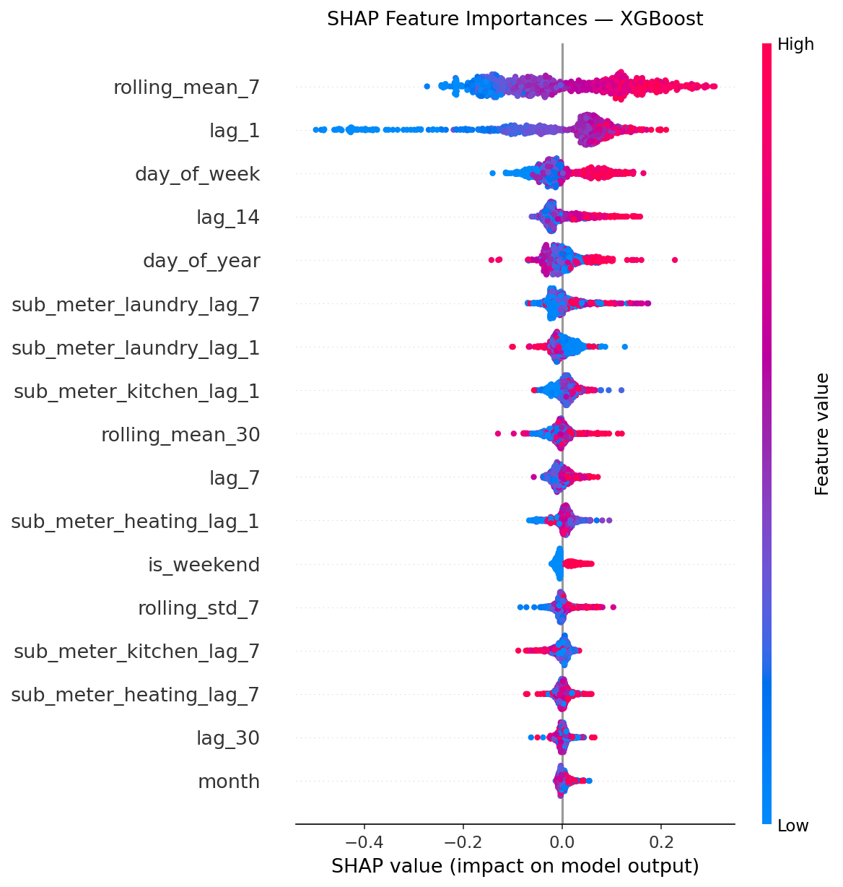

# Household Power Usage Forecasting

A structured time series forecasting project benchmarking five models — from classical statistical methods to a zero-shot transformer foundation model — against daily household electricity consumption. Built as a portfolio project to demonstrate end-to-end ML workflow development, model comparison, and evaluation rigor.

---

## Results


All models are evaluated on the same 361-day test period using three metrics averaged across 13 walk-forward folds.

| Model | RMSE | MAE | MAPE |
|-------|------|-----|------|
| ETS | 0.2996 | 0.2428 | 25.29% |
| Prophet | 0.2622 | 0.1986 | 20.61% |
| SARIMA | 0.2574 | 0.1956 | 21.29% |
| Chronos-Bolt-Base | 0.2532 | 0.1903 | 20.60% |
| XGBoost | **0.2395** | **0.1849** | **19.60%** |

**Key finding:** Chronos-Bolt-Base, applied entirely zero-shot with no training on this dataset, ranks second overall — outperforming every traditionally fitted model except XGBoost, and trailing it by only 0.014 RMSE. This highlights the practical value of time series foundation models as strong out-of-the-box baselines that require no feature engineering, hyperparameter tuning, or dataset-specific preprocessing.

---

## Forecast Charts

**Classical baselines — ETS and SARIMA**


**Modern ML — Prophet and XGBoost**


**Foundation model — Chronos-Bolt-Base (zero-shot, with 80% prediction interval)**


---

## XGBoost Feature Importances (SHAP)

SHAP values show each feature's directional contribution to XGBoost's output. `lag_1` and `rolling_mean_7` dominate, confirming that recent consumption history is the strongest predictor of the next day's usage.



---

## Dataset

**UCI Household Power Consumption** — minute-level electricity readings from a single French household (December 2006 – November 2010), aggregated to daily mean global active power (kW). Approximately 4 years of data across 1,442 observations after preprocessing.

- 25,979 missing values per column (encoded as `?`) — handled via linear interpolation
- **Train:** December 2006 – November 2009 (1,081 days)
- **Test:** December 2009 – November 2010 (361 days)

---

## Notebook Workflow

Each notebook is self-contained and builds on the outputs of the previous. All modeling notebooks share the same walk-forward evaluation strategy: 13 non-overlapping 30-day folds over the held-out test year, with an expanding training window that respects temporal order.

| # | Notebook | Purpose |
|---|----------|---------|
| 01 | `01_eda.ipynb` | Data ingestion, missing value handling (linear interpolation), daily aggregation, EDA, stationarity testing (ADF + KPSS), ACF/PACF, train/test split |
| 02 | `02_classical_baselines.ipynb` | ETS and SARIMA with walk-forward validation; multiplicative vs. additive seasonality comparison; month dummy exogenous regressors for SARIMA |
| 03 | `03_modern_ml.ipynb` | Prophet and XGBoost; lag/calendar feature engineering; SHAP feature importances |
| 04 | `04_foundation_model.ipynb` | Zero-shot forecasting with Chronos-Bolt-Base; probabilistic output with 80% prediction intervals; PI calibration check |

---

## Setup

Requires **Python 3.11**. A `.python-version` file is included for pyenv users.

```bash
pip install -r requirements.txt
jupyter notebook
```

---

## Methodology Notes

- **Walk-forward evaluation** is applied consistently: each fold conditions on all observed history and forecasts the next 30 days, simulating real deployment without look-ahead bias.
- **Oracle evaluation:** all models use actual observed test-set values as inputs at fold boundaries rather than recursively feeding their own predictions. This is appropriate for retrospective benchmarking but means real-world performance would be modestly worse, particularly for XGBoost whose lag features depend on recent actuals.
- **Chronos-Bolt-Base** is the only probabilistic model, outputting 9 quantiles per step. Point estimates use the median (q=0.5); 80% prediction intervals use q=0.1 and q=0.9, with coverage verified against the 80% target.
- **XGBoost** uses actual observed values for test-set lag features (batch evaluation mode), which is appropriate for retrospective benchmarking but differs from recursive multi-step forecasting in a live deployment context.
- **SHAP values** are computed for XGBoost to provide directional feature attribution, identifying `lag_1` and `rolling_mean_7` as the strongest predictors.

---

## Project Structure

```
household-power-usage/
├── data/                        # Raw and processed CSVs
├── notebooks/
│   ├── 01_eda.ipynb
│   ├── 02_classical_baselines.ipynb
│   ├── 03_modern_ml.ipynb
│   └── 04_foundation_model.ipynb
├── outputs/
│   ├── comparison.png           # Model leaderboard (visual)
│   ├── leaderboard.csv          # Consolidated model metrics
│   ├── classical_forecasts.png
│   ├── modern_ml_forecasts.png
│   ├── foundation_model_forecast.png
│   └── figures/
│       ├── xgboost_shap_importance.png
│       ├── prophet_cv_rmse.png
│       └── prophet_components.png
├── .python-version              # Python 3.11
├── requirements.txt
└── run_pipeline.py
```

---

## Skills Demonstrated

- **Time series EDA:** decomposition, stationarity testing (ADF, KPSS), ACF/PACF analysis
- **Classical forecasting:** ETS, SARIMA with auto model selection, exogenous regressors
- **Modern ML:** Prophet with custom seasonality; XGBoost with lag feature engineering, early stopping, and SHAP interpretability
- **Foundation models:** zero-shot inference with Chronos-Bolt-Base, probabilistic calibration evaluation
- **Evaluation rigor:** walk-forward cross-validation, consistent fold boundaries across all models, RMSE/MAE/MAPE, prediction interval coverage
