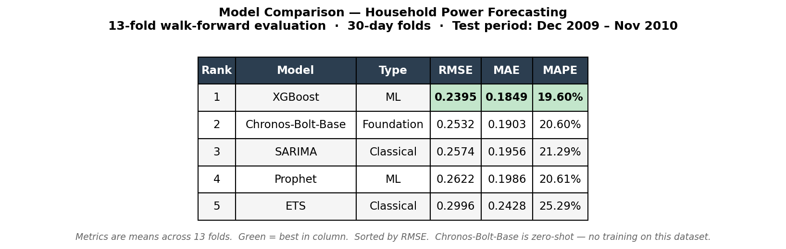
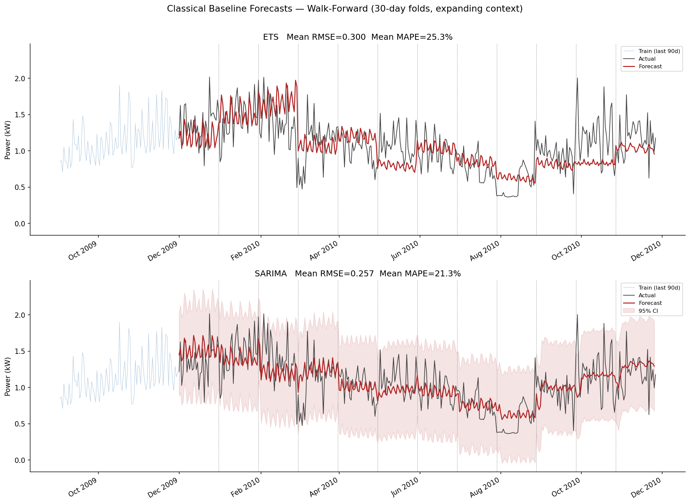
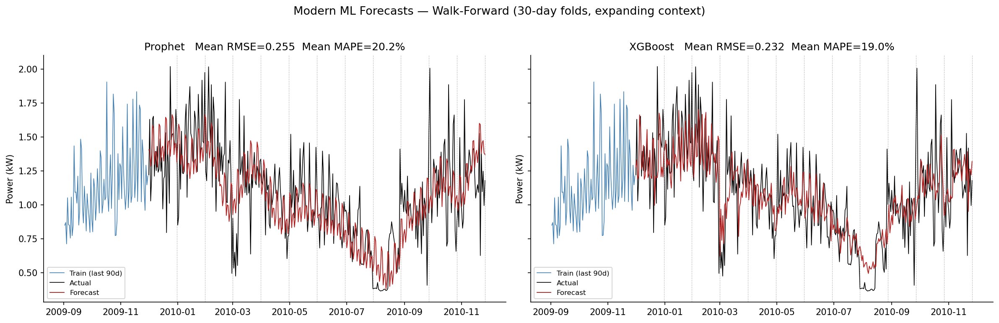
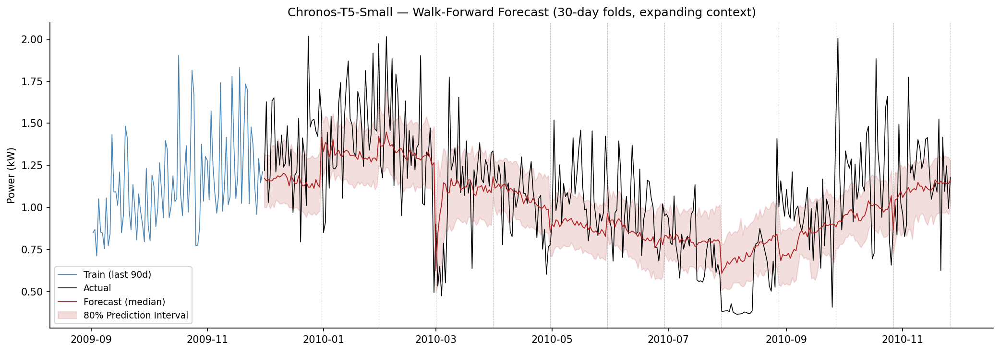
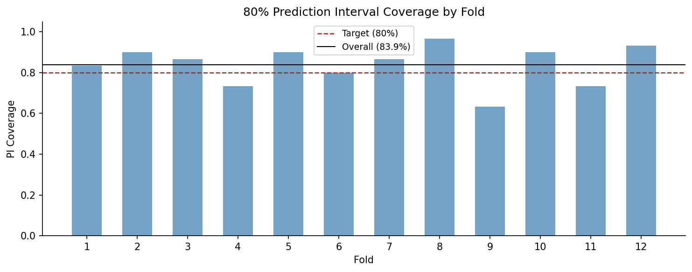

# Time Series Forecasting with a Foundation Model

A structured time series forecasting project benchmarking five models — beginning with classical statistical models, then moving to modern machine learning implementations, and finishing with a zero-shot foundation model. Forecasts are evaluated against daily household electricity consumption from the UC Irvine Individual Household Electric Power Consumption dataset. This project is designed to evaluate whether or not time series foundation models compete with established forecasting techniques.

---

## Summary

Residential electricity consumption follows complex, multi-scale patterns driven by weather, occupancy, appliance behavior, and seasonal routines. Accurate short-term forecasts of household power demand have practical value for demand-side management, cost optimization, and energy planning. The forecasting model landscape has changed with the emergence of pretrained time series foundation models that require no task-specific training data. All models are evaluated using walk-forward cross-validation on 12 non-overlapping 30-day folds from the held-out test year.



**Key finding:** Chronos-Bolt-Base, applied entirely zero-shot with no training on this dataset, ranks second overall — outperforming every traditionally fitted model except XGBoost, and trailing it by only 0.014 RMSE. This highlights the practical value of time series foundation models as strong out-of-the-box baselines that require no feature engineering, hyperparameter tuning, or dataset-specific preprocessing.

---

## Dataset

**UCI Household Power Consumption** — minute-level electricity readings from a single French household (December 2006 – November 2010), aggregated to daily mean global active power (kW). Approximately 4 years of data across 1,442 observations after preprocessing. Dataset available [here](https://archive.ics.uci.edu/dataset/235/individual+household+electric+power+consumption).

- 25,979 missing values per column (encoded as `?`) — handled via linear interpolation
- **Train:** December 2006 – November 2009 (1,081 days)
- **Test:** December 2009 – November 2010 (361 days)

---

## References

This project was inspired by the following survey, which motivated testing a zero-shot foundation model alongside classical and ML baselines as a structured comparison:

Kottapalli, S. R. K., Hubli, K., Chandrashekhara, S., Jain, G., Hubli, S., Botla, G., & Doddaiah, R. (2025). *Foundation Models for Time Series: A Survey*. arXiv preprint arXiv:2504.04011. https://arxiv.org/abs/2504.04011

---

## Methods

All models share the same evaluation protocol: 12 non-overlapping 30-day walk-forward folds over the held-out test year, with an expanding training window that prevents any look-ahead bias. At each fold boundary, models receive all observed history up to that point before forecasting the next 30 days. All models use actual observed test-set values as inputs at fold boundaries rather than recursively feeding their own predictions — this is appropriate for retrospective benchmarking but means real-world performance would be modestly worse, particularly for models whose inputs depend on recent actuals.

### Classical Models

**ETS** uses exponential smoothing with an additive trend and multiplicative seasonality (ETS(A,A,M)). Multiplicative seasonality was selected over additive because winter variance scales proportionally with the series level rather than remaining a fixed offset — confirmed by a lower AIC. The model is refitted from scratch at each fold on the expanding training window.

**SARIMA** is selected via `auto_arima` with `m=7` to capture the weekly seasonal component. Annual seasonality is modeled through 12 month dummy exogenous regressors rather than setting `m=365`, which would be computationally infeasible and produce unstable parameter estimates on daily data. The month dummies were validated against a no-exogenous-regressor baseline (ΔAIC = +23.9). At each fold, actual test observations are incorporated into the model state via `.update()`, updating the filter history without re-estimating parameters.



---

### Machine Learning Models

**Prophet** uses multiplicative seasonality with yearly and weekly components. French public holidays are included as a structural regressor, appropriate for a French household dataset. The model is refitted from scratch at each walk-forward fold on the expanding context window.

**XGBoost** requires explicit temporal structure since tree models have no native concept of time order. The feature matrix includes lag features at 1, 7, 14, and 30 days; 7- and 30-day rolling means and 7-day rolling standard deviation; calendar features (day of week, month, day of year, is_weekend); and lag-1 and lag-7 readings from three sub-meters (kitchen, laundry, heating). All features use `.shift(1)` to prevent the current observation from leaking into its own features. Calendar features are integer-encoded — appropriate for tree models that split on thresholds rather than treating feature values as magnitudes. The model is fitted once on the training window with early stopping against a held-out validation set, then evaluated in batch mode across the full test period using actual observed lag values.



---

### Foundation Model

Foundation models are defined by their ability to act as a universal tool for downstream tasks. Pretrained foundation models are designed to be applied to a wide variety of forecasting tasks, without themselves being explicitly tied to a given task. They are trained on a vast array of datasets with the objective of understanding structure common to time series data across several domains. Instead of fitting the model to a set of training data, a context window is passed to the model, much like a prompt to an LLM.

Foundation models can suffer from poor predictions if the application requires a large context window. For this project, the context window is large enough that the entirety of the training set can be passed in, allowing seasonality to be built into the context window provided. Performance can also suffer on highly noisy and short horizon data.


**Chronos-Bolt-Base (205M)** is applied entirely zero-shot — no fitting, no feature engineering, no hyperparameter tuning on this dataset. It is a transformer pretrained on approximately 600,000 real-world and synthetic time series, treating forecasting as a language modeling task over quantized value tokens. The full 1,081-day training history is passed as context at each fold, well within the model's 2,048-step context window. Unlike every other model in this project, Chronos outputs a probability distribution. Point forecasts use the median (q=0.5); 80% prediction intervals use q=0.1 and q=0.9, with empirical coverage verified against the 80% target. Chronos-Bolt models are a patch-based variant of the Chronos family of models, with significant memory and speed advantages. More info on the Chronos-Bolt models can be found [here](https://huggingface.co/amazon/chronos-bolt-base).



**Prediction intervals:** Unlike point forecasts, Chronos outputs a full predictive distribution at each time step. The 80% prediction interval (PI) is constructed from the q=0.1 and q=0.9 quantiles, meaning the model expects roughly 8 out of 10 actual observations to fall within the shaded band. Empirical coverage is computed per fold and compared against the 80% target — undercoverage indicates the intervals are too narrow (overconfident), while overcoverage indicates they are too wide (underconfident).



---

## Setup

Requires **Python 3.11**.

**Using conda (recommended):**
```bash
git clone <repo-url>
cd household-power-usage
conda create -n energy-forecast python=3.11
conda activate energy-forecast
pip install -r requirements.txt
```

**Using venv:**
```bash
git clone <repo-url>
cd household-power-usage
python -m venv .venv
.venv\Scripts\activate        # Windows
# source .venv/bin/activate   # macOS / Linux
pip install -r requirements.txt
```

**Run the full pipeline** (executes all four notebooks in order):
```bash
python run_pipeline.py
```

Individual notebooks can also be opened and run interactively with `jupyter notebook`.

---

## Project Structure

```
household-power-usage/
├── data/
│   ├── household_power_consumption.csv  # Raw UCI dataset
│   ├── daily_train.csv                  # Aggregated daily train split
│   └── daily_test.csv                   # Aggregated daily test split
├── notebooks/
│   ├── 01_eda.ipynb                     # EDA, preprocessing, train/test split
│   ├── 02_classical_baselines.ipynb     # ETS and SARIMA
│   ├── 03_modern_ml.ipynb               # Prophet and XGBoost
│   └── 04_foundation_model.ipynb        # Chronos-Bolt-Base and comparison
├── outputs/
│   ├── comparison.png                   # Model comparison chart
│   ├── leaderboard.csv                  # Consolidated model metrics
│   ├── classical_metrics.csv
│   ├── modern_ml_metrics.csv
│   ├── foundation_model_metrics.csv
│   ├── classical_forecasts.png
│   ├── modern_ml_forecasts.png
│   ├── foundation_model_forecast.png
│   └── figures/
│       ├── chronos_pi_coverage.png      
│       ├── xgboost_shap_importance.png
│       ├── prophet_cv_rmse.png
│       └── prophet_components.png
├── .python-version                      # Python 3.11
├── requirements.txt
└── run_pipeline.py                      # Executes all notebooks end-to-end
```
